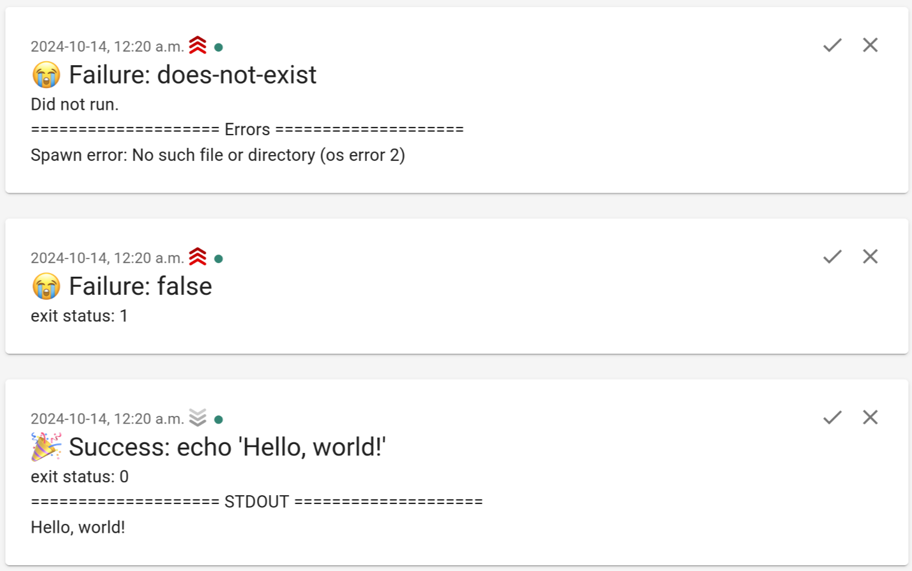

# `ntfy-run`

`ntfy-run` is a tool to run a command, capture its output, and send it to a
`ntfy` server.

It's designed to be similar to `cron`'s `MAILTO` feature, sending an email if
the command running under `ntfy-run` generated any output, but this behaviour
can be changed with flags.

## Installation

You can download a binary from GitHub releases:

```bash
sudo wget https://github.com/quantum5/ntfy-run/releases/latest/download/ntfy-run-amd64 -O /usr/local/bin/ntfy-run
sudo chmod a+x /usr/local/bin/ntfy-run
```

Alternatively, build it yourself:

```bash
git clone https://github.com/quantum5/ntfy-run.git
cd ntfy-run
cargo build --release
sudo cp target/release/ntfy-run /usr/local/bin
```

## Usage

All options can be specified on the command line, as both short and long
options, but also as environment variables.

### Basic Example

Simple notification to an `ntfy.sh` URL:

```bash
NTFY_URL=https://ntfy.sh/hello ntfy-run echo 'Hello, world!'
ntfy-run --ntfy-url https://ntfy.sh/hello echo 'Hello, world!'
ntfy-run -n https://ntfy.sh/hello echo 'Hello, world!'
```

This will generate a notification with title `Success: echo 'Hello, world!'`
and the following body:

```
exit status: 0
==================== STDOUT ====================
Hello, world!
```

For simplicity's sake, all subsequent commands will assume you have the
environment variable `NTFY_URL=https://ntfy.sh/hello` set.

### Authentication

You can use the `-t` or `--token` flag (or the `NTFY_TOKEN` environment
variable) to pass an access token to `ntfy`:

```bash
NTFY_TOKEN=tk_example ntfy-run echo 'Hello, world!'
ntfy-run -t tk_example echo 'Hello, world!'
```

You can also use the `-u` or `--user` flag in combination with the `-p` or
`--password` flag (or the `NTFY_USER` and `NTFY_PASSWORD` environment variables)
to pass a user and password combination:

```bash
NTFY_USER=example NTFY_PASSWORD=hunter2 ntfy-run echo 'Hello, world!'
ntfy-run -u example -p hunter2 echo 'Hello, world!'
```

### Filtering notifications

By default, nothing is generated on successful executions that generate no
output. For example, the following command generates no notification:

```bash
ntfy-run true
```

You can pass the `-N` or `--always-notify` flags, or `NTFY_ALWAYS_NOTIFY=true`
environment variable to force a notification anyway:

```bash
ntfy-run -N true
```

You can also use the `-o` or `--only-failures` flags, or `NTFY_FAILURE_ONLY=true`
environment variable to only notify on successful executions:

```bash
# No notification:
ntfy-run -o echo 'Hello, world!'

# Will generate a notifications:
ntfy-run -o false
ntfy-run -o sh -c 'echo "Hello, world!"; false'
```

### Message titles

By default, the message title is `Success:` or `Failure:` followed by the
command line. You can change the command line portion with the `-T` or `--title`
flag, or the `NTFY_TITLE` environment variable:

```bash
# Title: Success: echo 'Hello, world!'
ntfy-run echo 'Hello, world!'

# Title: Success: my title
ntfy-run -T 'my title' echo 'Hello, world!'
```

You can override the title on success or failure with the following flags:

* `-s`, `--success-title` or `NTFY_SUCCESS_TITLE` environment variable; and
* `-f`, `--failure-title` or `NTFY_FAILURE_TITLE` environment variable.

```bash
# Title: My action succeeded
ntfy-run -s 'My action succeeded' echo 'Hello, world!'

# Title: My action failed
ntfy-run -f 'My action failed' false
```

### Message priorities and tags

You can override the message priority on success or failure with the following
flags:

* `-S`, `--success-priority` or `NTFY_SUCCESS_PRIORITY` environment variable;
  and
* `-F`, `--failure-priority` or `NTFY_FAILURE_PRIORITY` environment variable.

You can override the message tags on success or failure with the following
flags:

* `-a`, `--success-tags` or `NTFY_SUCCESS_TAGS` environment variable; and
* `-A`, `--failure-tags` or `NTFY_FAILURE_TAGS` environment variable.

```bash
ntfy-run -S min -F max -a tada -A sob echo 'Hello, world!'
ntfy-run -S min -F max -a tada -A sob false
ntfy-run -S min -F max -a tada -A sob does-not-exist
```

Result:


### Email

You can get `ntfy` to send an email alongside the notification by passing the
`-e` or `--email` flag, or with the `NTFY_EMAIL` environment variable.

### Icon

You can get `ntfy` to display an icon by passing its URL as the `-i` or `--icon`
flag, or with the `NTFY_ICON` environment variable.

### `crontab`

In `vixie-cron` and similar implementations, you can use `ntfy-run` as follows:

```crontab
NTFY_URL=https://ntfy.sh/hello
NTFY_TOKEN=tk_example
NTFY_ALWAYS_NOTIFY=true
0 0 * * * ntfy-run backup-server
```
